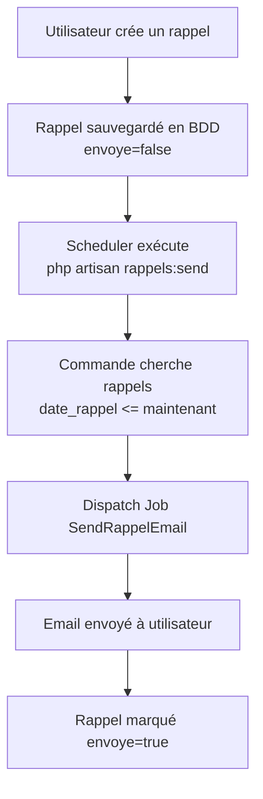

# 📧 SYSTÈME D'ENVOI D'EMAILS - CheckVéhicule

> **Status :** ✅ **COMPLET ET PRÊT POUR PRODUCTION**

Un système professionnel et automatisé d'envoi d'emails pour rappeler aux utilisateurs leurs entretiens programmés.

---

## 🚀 Démarrage Rapide

```bash
# 1. Configuration (éditer .env)
MAIL_MAILER=log

# 2. Migration
php artisan migrate

# 3. Test
php artisan rappels:test

# 4. Vérification
tail -f storage/logs/laravel.log
```

**Durée totale : 5 minutes** ⚡

---

## 📋 Ce qui a été implémenté

### ✅ 9 Fichiers Code
- **Job** : `app/Jobs/SendRappelEmail.php` - Envoie l'email
- **Commands** : `SendRappelReminders.php` + `TestRappelEmail.php` - Exécution et test
- **Mail** : `app/Mail/RappelEmail.php` - Classe Mailable améliorée
- **Notification** : `app/Notifications/RappelNotification.php` - Notifications
- **View** : `resources/views/emails/rappel.blade.php` - Template email professionnel
- **Database** : `RappelSeeder.php` + migrations avec index
- **Tests** : `tests/Feature/RappelEmailTest.php` - Tests complets

### ✅ 6 Guides Documentation
- **QUICK_START.md** - 5 minutes pour démarrer
- **COMMANDS.md** - Commandes essentielles
- **MAIL_IMPLEMENTATION.md** - Guide pratique complet
- **MAIL_SETUP.md** - Configuration détaillée
- **RAPPELS_IMPLEMENTATION.md** - Documentation technique
- **IMPLEMENTATION_COMPLETE.md** - Résumé complet

### ✅ Fichiers Utilitaires
- **IMPLEMENTATION_SUMMARY.json** - Résumé technique
- **INDEX.html** - Vue d'ensemble visuelle
- **rappels-helper.sh** - Script d'aide
- **verify-implementation.sh** - Vérification

---

## 🎯 Comment Ça Marche



---

## 📊 Commandes Essentielles

| Commande | Effet |
|----------|-------|
| `php artisan rappels:test` | 🧪 Créer + envoyer un test |
| `php artisan rappels:send` | 📧 Envoyer les rappels en attente |
| `php artisan test tests/Feature/RappelEmailTest.php` | ✅ Tests automatisés |
| `tail -f storage/logs/laravel.log` | 📋 Logs en temps réel |
| `php artisan tinker` | 🔧 Console interactive |

---

## ⚙️ Configuration

### Développement Local
```bash
# .env
MAIL_MAILER=log
MAIL_FROM_ADDRESS=noreply@checkvehicule.local
MAIL_FROM_NAME=CheckVéhicule
```

### Production avec Gmail
```bash
# .env
MAIL_MAILER=smtp
MAIL_HOST=smtp.gmail.com
MAIL_PORT=587
MAIL_ENCRYPTION=tls
MAIL_USERNAME=votre_email@gmail.com
MAIL_PASSWORD=votre_mot_de_passe_app  # Mot de passe d'app Google
MAIL_FROM_ADDRESS=votre_email@gmail.com
MAIL_FROM_NAME=CheckVéhicule
```

### CRON Job (Production)
```bash
# Ajouter à crontab
* * * * * cd /path/to/project && php artisan schedule:run >> /dev/null 2>&1
```

---

## 🧪 Tests

### Test Rapide
```bash
php artisan rappels:test
```

### Test Complet
```bash
php artisan test tests/Feature/RappelEmailTest.php
```

### Test Manuel
```bash
php artisan tinker

# Créer un rappel
Rappel::create([
    'user_id' => 1,
    'vehicule_id' => 1,
    'type' => 'entretien',
    'date_rappel' => now()->subMinutes(1),
    'envoye' => false
]);

exit

# Envoyer
php artisan rappels:send

# Vérifier
tail -f storage/logs/laravel.log
```

---

## 📚 Documentation Complète

Consultez ces fichiers pour plus de détails :

| Fichier | Contenu | Durée de lecture |
|---------|---------|------------------|
| [QUICK_START.md](QUICK_START.md) | Démarrage rapide | 3 min |
| [COMMANDS.md](COMMANDS.md) | Commandes essentielles | 5 min |
| [MAIL_IMPLEMENTATION.md](MAIL_IMPLEMENTATION.md) | Guide pratique | 15 min |
| [MAIL_SETUP.md](MAIL_SETUP.md) | Configuration détaillée | 20 min |
| [RAPPELS_IMPLEMENTATION.md](RAPPELS_IMPLEMENTATION.md) | Documentation technique | 30 min |
| [INDEX.html](INDEX.html) | Vue d'ensemble visuelle | 5 min |

---

## ✨ Fonctionnalités

✅ Envoi automatique d'emails  
✅ Scheduling intégré (toutes les minutes)  
✅ Queue jobs pour arrière-plan  
✅ Template email professionnel  
✅ Logging complet  
✅ Tests automatisés  
✅ Prêt pour production  
✅ Facile à personnaliser  
✅ Support SMTP, Mailgun, etc.  
✅ Documentation complète  

---

## 🏗️ Architecture

```
app/
  ├── Jobs/
  │   └── SendRappelEmail.php ...................... Envoi email (Job)
  ├── Console/Commands/
  │   ├── SendRappelReminders.php ................. Cherche & envoie
  │   └── TestRappelEmail.php ..................... Test rapide
  ├── Mail/
  │   └── RappelEmail.php ......................... Classe Mailable
  └── Notifications/
      └── RappelNotification.php .................. Notification

resources/views/
  └── emails/
      └── rappel.blade.php ....................... Template email

database/
  ├── seeders/
  │   └── RappelSeeder.php ....................... Données test
  └── migrations/
      └── *_add_indexes_to_rappels_table.php .... Optimisations

tests/Feature/
  └── RappelEmailTest.php ........................ Tests complets

config/
  └── mail.php ................................. Configuration email
```

---

## 🔐 Sécurité

✅ Validation des données  
✅ Authorization par utilisateur  
✅ Queue jobs (pas d'exécution directe)  
✅ Logging et traçabilité  
✅ Gestion des erreurs  

---

## 📈 Prochaines Améliorations

### Facile
- [ ] SMS notifications
- [ ] Notifications in-app
- [ ] Préférences par utilisateur

### Moyen
- [ ] Rappels multiples (1j avant, 1 sem avant)
- [ ] Rapports en PDF
- [ ] Webhooks

### Avancé
- [ ] Intégration CalDAV
- [ ] Machine learning
- [ ] API REST mobile

---

## ❓ FAQ

### "Je ne reçois pas l'email"
Vérifiez :
1. La date du rappel est passée ? (`date_rappel <= maintenant`)
2. Le rappel n'est pas marqué comme envoyé ? (`envoye = false`)
3. Avez-vous exécuté `php artisan rappels:send` ?

### "Quelle est la différence entre log et SMTP ?"

| Mode | Effet | Utilisation |
|------|-------|-------------|
| `log` | L'email s'écrit dans un fichier | Développement |
| `smtp` | L'email est vraiment envoyé | Production |

### "Comment tester en production ?"
Utilisez [Mailtrap](https://mailtrap.io) (gratuit) - capture les emails sans les envoyer.

### "Quand sont envoyés les emails ?"
Chaque minute, si la CRON job est configurée :
```bash
* * * * * cd /path && php artisan schedule:run
```

---

## 🎓 Ressources

- [Laravel Mail Documentation](https://laravel.com/docs/mail)
- [Laravel Queue Jobs](https://laravel.com/docs/queues)
- [Laravel Scheduling](https://laravel.com/docs/scheduling)
- [Mailtrap (email testing)](https://mailtrap.io)
- [Gmail App Passwords](https://myaccount.google.com/apppasswords)

---

## ✅ Checklist Production

- [ ] Configuration `.env` vérifiée
- [ ] CRON job ajoutée
- [ ] Test d'email reçu
- [ ] Template email personnalisé
- [ ] Logs configurés
- [ ] Tests exécutés
- [ ] Backup en place

---

## 🎉 Résultat Final

Vous avez maintenant :
- ✅ Un système d'emails **complet et fonctionnel**
- ✅ Automatisation en place
- ✅ Tests inclus
- ✅ Documentation complète
- ✅ **Prêt pour production**

---

## 📞 Support

**Questions ?** Consultez :
1. **QUICK_START.md** pour le démarrage rapide
2. **MAIL_IMPLEMENTATION.md** pour un guide pratique
3. **Les logs** : `tail -f storage/logs/laravel.log`
4. **Tinker** : `php artisan tinker` pour déboguer

---

## 📝 Fichiers Principaux

```
INDEX.html ............................ Vue d'ensemble visuelle
QUICK_START.md ........................ Démarrage (5 min)
COMMANDS.md ........................... Commandes essentielles
MAIL_IMPLEMENTATION.md ................ Guide pratique
MAIL_SETUP.md ......................... Configuration
RAPPELS_IMPLEMENTATION.md ............. Documentation technique
IMPLEMENTATION_COMPLETE.md ............ Résumé complet
IMPLEMENTATION_SUMMARY.json ........... Résumé JSON
```

---

**Implémentation Complète ✅**  
Version 1.0.0 | Date : 15 janvier 2026  
Status : Production Ready 🚀

Consultez **QUICK_START.md** pour commencer immédiatement !
